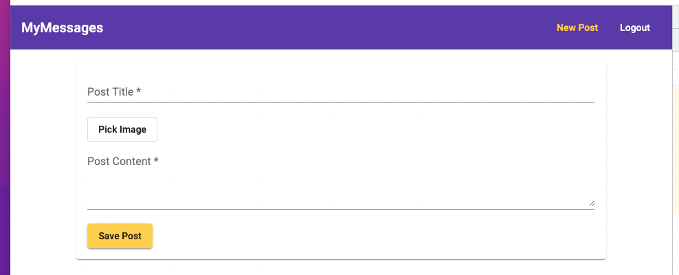

# MEAN_Stack_Project

## Table of contents
* [General info](#general-info)
* [How to](#how-to)

## General info
👋 Hi,this is a small MEAN stack project using Angular and MongoDB. This app is capable of completing account registration with an email like address, creating posts and attach photos within each account. Posts can be edited and deleted by each account. All posts created by each acconut are listed on the first page.

## How to
1. Before installing this app, you need to have an account with MongoDB Atlas (it's free).
2. Download the package and run **npm install** in the __mean-project__ folder. This command will install all the packages needed.
3. In __backend__ folder, _app.js_** file, change the connection string to your own connection string(from your own MongoDB Atlas) as indicated below.
mongoose
  .connect(
    "YOUR OWN CONNECTION STRING"
  )
4. After it is done installing, run **ng serve** to start the front end, run **npm run start:server** to connect to the MongoDB database.
